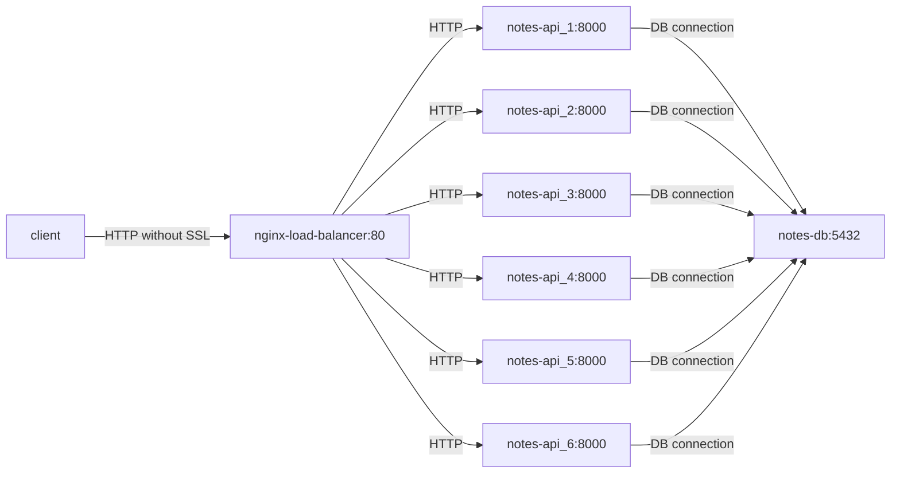

## Nginx Notes API's

Notes Restful API's hosted on nginx server.


## How to run application?

prerequisite: docker/ docker-compose
postgres container is acting weird, if you face any issue please write me karthikerathore@gmail.com
```bash
docker-compose down -v; docker-compose build;docker-compose up
```
See spec/openapi.yml to test all the API's locally.

## How to enter postgres container for debuggging?

```bash
docker exec -it notes-db psql -U postgres
```

## smol architecture



## uWSGI architecture


Libraries used 
1. Flask-Restful lib
2. gunicorn
3. postgresQL
4. nginx
5. docker-compose


## core features
* added text search index for search notes
* added rate limiter for controlling API requests.
* disabled `TCP_NODELAY` option for performance.
