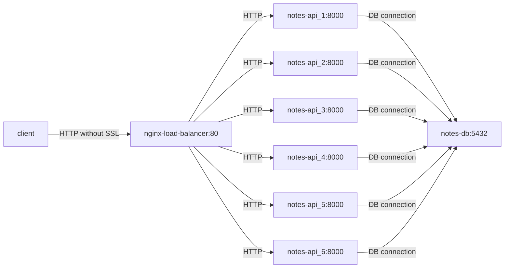
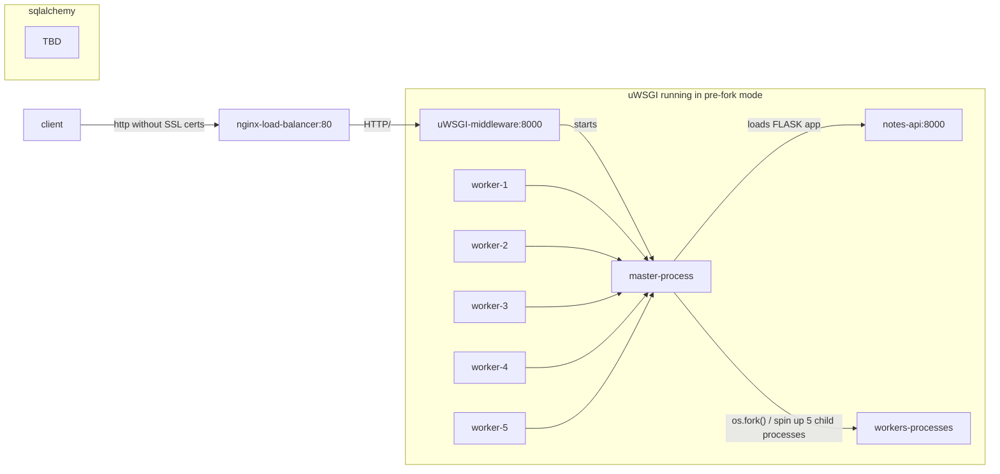

## Nginx Notes API's

Aim of the project

- test and evaluate performance of services like memory, cpu usage using various tools like grafana, prometheus, locust.
    - write base line performance of app.
- understand uWSGI architecture.
- understant Nginx architecture
- implement multi-processing(CPU bound task)/threading (IO bound task) APIs.
- understand [Dismissing Python Garbage Collection at Instagram](https://instagram-engineering.com/dismissing-python-garbage-collection-at-instagram-4dca40b29172)
- understand goroutines and try it integrate it with flask app.
- kubernetes to manage containers

## How to run application?

0. prerequisite: Docker/ Docker Compose version v2.24.0

If you face any issue please write me karthikerathore@gmail.com

1. run containers in production mode. (fails to run on mac silicon, run app in develop mode)
```bash
docker-compose down -v --remove-orphans; \
docker-compose --profile production build; \
docker-compose --profile production up;
```

2. run containers in develop mode.
```bash
docker-compose down -v --remove-orphans; \
docker-compose -f docker-compose-develop.yml down -v --remove-orphans; \
docker-compose -f docker-compose-develop.yml --profile develop build; \
docker-compose -f docker-compose-develop.yml --profile develop up;
```

3. clean up. run this if you are facing network <id> not found.
```bash
docker-compose down -v --remove-orphans; \
docker-compose -f docker-compose-develop.yml down -v --remove-orphans;
```

See spec/openapi.yml to test all the API's locally.

## How to use tools ?

0. first you gotta register yourself.
```bash
go build && ./tools --address http://0.0.0.0:80/  \
	--username karthikeyan  \
	--password karthikeyan  \
	--register
```

1. After that you can publish your notes from anywhere.
```bash
go build && ./tools --address http://0.0.0.0:80/  \
	--username karthikeyan  \
	--password karthikeyan  \
	--path_dir /home/vagrant/notes \
	--publish
```


## How to develop app using [compose watch](https://docs.docker.com/compose/file-watch/#sync--restart)?
```bash
docker-compose -f docker-compose-develop.yml --profile develop  watch
```

## How to enter postgres container for debuggging?

```bash
docker exec -it notes-db psql -U postgres
```

## smol architecture



## uWSGI architecture




## core features
* added text search index for search notes
* added rate limiter for controlling API requests.
* disabled `TCP_NODELAY` option for performance.


## Todos
- [x] setup prometheus and grafana for monitoring.
- [ ] setup k8s
- [ ] include testcases for APIs